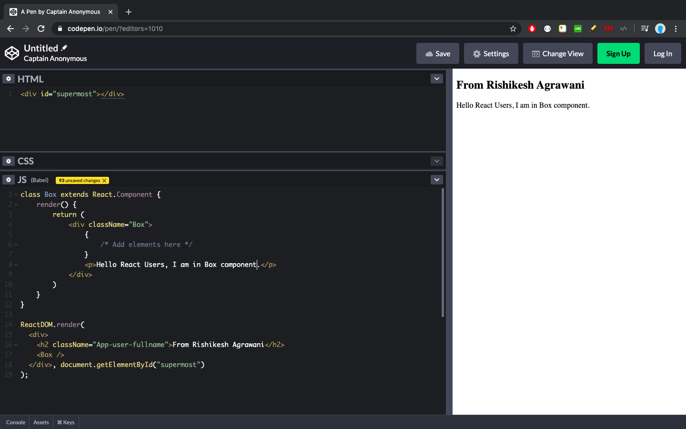

# react-code-producer


An npm package to generate React code snippets for Component, functions etc.

## Generate code at terminal &

+ copy and use it to quickly test what you learned (beginners)

+ use in projects or other developement environment if your editor/IDE does have any plugins etc. (professionals)

+ Other usages e.g. to test functionality in scripts etc. (beginners, professionals)

    > As I have shown here, how I directly copied the **`Box`** component and pasted directly above **`ReactDOM.render(...)`** statement. 
    >
    > The thing is, before copy paste work, you have to configure settings at Codepen. 
    >
    > Just setup you **Babel transpiler**, add **React** libraries and then try as shown in the below image.



## Note

+ React uses different style to add comments among JSX code. 
So please write code after 

```javascript
{ 
    /* Add elements here */ 
    
}
``` 

React comment statement, not just inside the curly braces while using the copied in your **React** application.

## Table of contents

+ [Getting started](#getting-started)

+ [Code samples](#code-samples)

+ [Exmaples](#examples)

    + [Example 1 - Single Component](#example-1)

    + [Example 2 - Single Component, 2nd usage style](#example-2)

    + [Example 3 - Multiple Components](#example-3)

<h2 id="getting-started">:point_right: Getting started</h2>

+ **`npm install react-code-producer --save`**  

    > `Installs locally`

+ **`npm install react-code-producer --global`**  

    > `Installs globally`


<h2 id="code-samples">:pushpin: Code samples</h2>

<h2 id="examples">:notebook: Examples</h2>

<h3 id="example-1">Example 1 - Single Component</h3>

> **Code** `code.js`

```javascript
const ReactCodeProducer = require("react-code-producer")

let App = new ReactCodeProducer()

console.log(App.getComponentCode('App'))
```

> **Output** `node code.js`

```bash
import React from 'react';
import ReactDOM from 'react-dom';

// React Component class `App`
class App extends React.Component {
    render() {
        return (
            <div className="App">
                { 
                    /* Add elements here */ 
                }

            </div>
        )
    }
}
```

<h3 id="example-2">Example 2 - Single Component, 2nd usage style</h3>

> **Code** `code.js`, `(Automatic class name conversion, if it looks improper)`

```javascript
const ReactCodeProducer = require("react-code-producer")

let App = new ReactCodeProducer()

console.log(App.getComponentCode('box'))
```

> **Output** `node code.js`

```bash
import React from 'react';
import ReactDOM from 'react-dom';

// React Component class `Box`
class Box extends React.Component {
    render() {
        return (
            <div className="Box">
                { 
                    /* Add elements here */ 
                }

            </div>
        )
    }
}

export default Box;
```

<h3 id="example-3">Example 3 - Multiple Components</h3>

> **Code** `code.js`

```javascript
const ReactCodeProducer = require("react-code-producer")

let AppIndex = new ReactCodeProducer({
    component: {
        code: true,
        names: [
            'App',
            'Index'
        ]
    }
})

console.log(AppIndex.code)
```

> **Output** `node code.js`

```bash
import React from 'react';
import ReactDOM from 'react-dom';

// React Component class `App`
class App extends React.Component {
    render() {
        return (
            <div className="App">
                { 
                    /* Add elements here */ 
                }

            </div>
        )
    }
}

// React Component class `Index`
class Index extends React.Component {
    render() {
        return (
            <div className="Index">
                { 
                    /* Add elements here */ 
                }

            </div>
        )
    }
}

export default App;
export default Index;
```

## Project Structure

```bash
react-code-producer
|
├── LICENSE
├── README.md
├── _config.yml
├── docs
│   └── images
│       └── codepen.png
├── node_modules
│   └── string-format
│       ├── LICENSE
│       ├── README.md
│       ├── index.js
│       └── package.json
├── package-lock.json
├── package.json
├── src
│   ├── index.js
│   └── snippets
│       ├── component.js
│       └── imports.js
└── tests
    └── test.js
```

Thank you very much.
